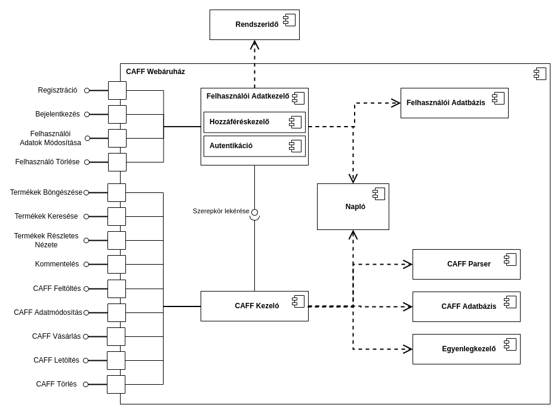

# Követelmények

## Funkcionális követelmények

Követelmények:
* Guest
    * Regisztráció
* Alap user
    * Belépés
        * Termék lista böngészése
        * Termékek keresése cím alapján
        * Részletes termék nézet megnyitása/nézése
            * Kommentek megtekintése és hozzáadása
            * Vásárlás/Letöltés
        * CAFF feltöltése
            * Nevet, árat adni
        * Felhasználói adatok módosítása
            * Fiók törlése (összes CAFF törlése)
        * saját CAFF-ok kezelése
            * törlés
            * ár/név változtatás
* Admin user
    * Belépés
    * User kezelés
        * törlés
        * módosítás
        * létrehozás
        * egyenleg kezelés: feltöltés, módosítás
    * Admin user kezelés
        * Új admin hozzáadása
        * Admin töröl
    * CAFF kezelése
        * törlés
        * adatmódosítás
    
[Use-case diagram + függőségi nyilak]

## Biztonsági követelmények és célok

A biztonsági követelményeket és célokat az alábbi kategóriák szerint csoportosíthatjuk. A fentebb részletezettek szerint három féle felhasználót különböztetünk meg: vendéget (nem bejelentkezett), felhasználót (bejelentkezett, normál), és adminisztrátor felhasználót. 

* Bizalmasság
    * Személyes adatokokat és az egyenleget csak az adott felhasználó illetve az adminisztrátorok láthatják.
    * A feltöltött CAFF fájlok csak bejelentkezés után tekinhetők meg.
* Integritás
    * Egy felhasználó személyes adatait csak adott felhasználó vagy admin módosíthaja.
    * Egy felhasználó egyenlegét közvetlenül csak egy admin módosíthatja. 
    * Egy feltöltött CAFF fájl adatait (nevét, árát) csak a tulajdonosa (aki feltötte) illetve admin módosíthatja.
* Elérhetőség
    * Az admininsztrátoroknak mindig el kell tudni érniük a rendszert.
    * A felhasználók is mindig eléhetik a rendszert, leszámítva az esetleges karbantartásokat.
* Autentikáció
    * Csak bejelentkezés után lehet elérni a rendszer felhasználói funkcióit (CAFF böngészés, vásárlás, feltöltés) és adminisztrátori funkcióit. 
    * Adminisztrátori fiókot csak meglévő Adminisztrátori fiókkal lehet létrehozni.
* Autorizáció
    * [insert admin feladatok] jogosultsághoz kötött tevékenység
    * A webáruház elérése bejelentkezéshez kötött
* Auditiálás
    * Minden felhasználó minden tevékenységet naplózni kell.

## Threat assessment

### Asset-ek

* Fizikai
    * Hardware
* Logikai
    * A felhasználók minden személyes adata
    * CAFF file-ok
    * a felhasználók egyenlegei

    

### Támadó modell kidolgozása

A támadómodell kidolgozását a STRIDE kereterendszer alapján tehetjük meg. 

* Spoofing:
    * Social engineering támadás az adminok ellen.
    * Felhasználó admininsztrátori funkciókat próbál elérni.
    * Vendég próbál felhasználói funkciókhoz hozzáférni.
    * Adatbázis hozzáférés történik a rendszeren kívülről.
* Tampering
    * Sérül kommunikáció az adatbázisokkal.
    * Webes kommunikáció manipulálása.
    * Komponensek közötti kommunikáció módosítása.
    * Kártevő bejutása CAFF fájlokkal. (veszélyes a szerverre és arra is aki letölti a CAFF-ot) 
    * CAFF feldolgozásból adódó sérülékenységek (nem megfelelő parser logika, buffer overflow lehetőség az implementációban)
    * Logok módosítása. 
    * Egy felhasználó módosítja az egyenlegét. 
* Letagadás 
    * Egy user letagadja, hogy megkapta a pénzt egy másiktól.
    * User letagadja, hogy ő letörölte az értéket CAFF fájlját.
    * Admin kitöröl mindent és letagadja.
* Denial of Service
    * Fizikai támadás éri a szervert. 
    * Túl nagy fájl feltöltése.
    * DDoS támadás
    * Túl sok komment
    * Túl sok regisztráció.
* Information disclosure.
    * Felhasználói adatok kiszívárognak.
    * Egy felhasználó hozzáfér más adataihoz.
    * Jelszó kiszvirgás.
    * Admin hozzáfér a plaintext jelszavakhaz
    * Vendég felhasználó tudja böngészni a feltöltött CAFF listát.
    * Admin jelsző kiszivárog. 
* Elevation of privilige
    * Vendég, felhasználói jogosultságot szeret (bejelentkezés nélkül használja a rendszert).
    * Egy felhasználó adminisztrátori jogosultságot szerez.  

### Mitigációs lépések

A fenti támadási felületek alapján az alábbi védekezések szükségesek.

Sok támadási felületet meg tudunk szüntetni a megfelelő autentikációval (jelszavas) és hozzáférés kezeléssel.  

A fizikai támadások illetve a túlterheléses támadások problémáját átháríjük egy felhő szolgáltatóra.

A letagadás jellegű fenyegetéseket részletes naplózással küszöböljük ki. 

A konkrét fenyegetésekre adott válaszokat alább részletezzük. 

* Spoofing:
    * Social engineering támadás az adminok ellen.  --> figyelemfelhívó campaign-ok és oktatások szervezése (kívül esik a házi feladat keretein)
    * Felhasználó admininsztrátori funkciókat ér el. --> !!! Megfelelő hozzáférés kezelő logika.
    * Bejelentkezés nélküli hozzáférés a CAFF-okhoz. --> Jelszavas bejelentkezés. Megfelelő hozzáférés kezelő logika.
    * Adatbázis hozzáférés történik a rendszeren kívülről. --> A felhőszolgáltató felelőssége. ??? - enkriptált adattárolás
* Tampering
    * Sérül kommunikáció az adatbázisokkal.  --> A felhőszolgáltató felelőssége.
    * Webes kommunikáció manipulálása. --> https használata
    * Komponensek közötti kommunikáció módosítása. --> ??? - Zárt rendszeren 
    * Kártevő bejutása CAFF fájlokkal. (veszélyes a szerverre és arra is aki letölti a CAFF-ot) --> Feltöltött CAFF-ok ellenőrzése.
    * CAFF feldolgozásból adódó sérülékenységek (nem megfelelő parser logika kihasználása, buffer overflow lehetőség az implementációban) --> Alapos tesztelés. 
    * Logok módosítása. --> A logok írásának zárolása, biztonsági mentések létrehozása.
* Denial of Service
    * Fizikai támadás éri a szervert. --> Felhőszolgáltató felelőssége.
    * Túl nagy fájl feltöltése. --> Fájlméret ellenőrzése.
    * DDoS támadás --> Felhőszolgáltató felelőssége.
    * Túl sok komment --> Kommentelés limitálása felhasználónként.
    * Túl sok regisztráció --> kívül esik a prioritásainkon
* Information disclosure --> access control
    * Felhasználó adatok kiszívárognak --> Titkosított adattárolás. Megfelelő access kontrol.
        * Egy felhasználó hozzáfér más adataihoz.
        * Jelszó kiszvirgás -> jelszó hash-t tárolunk (sózott)
    * Admin hozzáfér a plaintext jelszavakhaz
    * Vendég felhasználó tudja böngészni a feltöltött CAFF listát.
    * Admin jelsző kiszivárog. --> Kívül esik
* Elevation of privilige
    * Vendég, felhasználói jogosultságot szeret (bejelentkezés nélkül használja a rendszert).
    * Egy felhasználó adminisztrátori jogosultságot szerez.  

## Architektúra tervek

### Komoponens diagram

    

### Rendszer viselkedése - szekvencia diagramok

* Regisztráció
* Belépés
* Feltöltés
* Letöltés
* Admin feladatok
    * Adat módosítás

## Tesztelési terv

* Minden komponens alávetése code review-nak és statikus analízis eszközöknek.
* A parser fuzzolása
* Ha Flask lesz a backend: https://www.securecoding.com/blog/penetration-testing-in-flask-application/
* Manuális tesztelés

# Feladatok:
* Árpi: 
    * Komponens diagram
    * Architektúra tervek szövege -> minden interfészről 1-2 mondat
* Heni:
    * Use case diagram 
    * Funkcionális követelmények
    * Biztonsági követelmények
* Máté:
    * Szekvencia diagramok
* Misi:
    * mitigációs lépések tisztázása
    * adatfolyam diagramról szöveg

# Megjegyzések

Komponensdiagramban a parser legyen egy külön komponens a CAFF Áruházon kívül