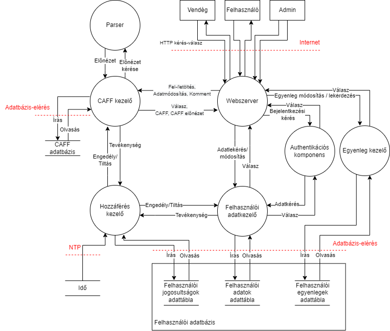
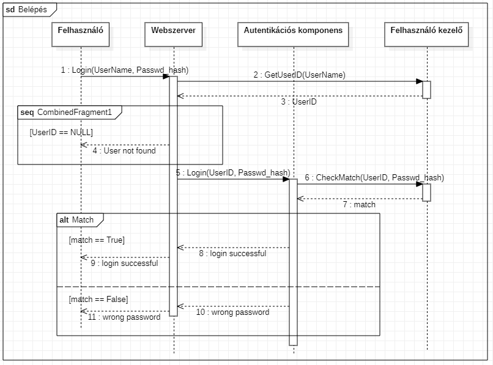

# Bevezetés

Egy olyan online áruházat kell készíteni, amiben egyedi formátumú animált képeket lehet böngészni. A szoftvernek a CAFF (CrySyS Animated File Format) formátumot kell támogatnia. A teljes rendszer kell, hogy tartalmazzon egy HTTP(S) protokollon elérhető távoli szolgáltatást, valamint az ahhoz tartozó webes vagy mobil klienst.

Felhasznált formátumok:
* CAFF fájlformátum
    * tömörítés nélküli animációformátum
    * CIFF képek tárolására alkalmas
    * az animációhoz tartozó metaadatokat tárolja
* CIFF fájlformátum
    * tömörítés nélküli képformátum
    * pixel informácikat tartalmaz
    * a képhez tartozó metaadatokat tárolja

A rendszernek támogatnia kell az alábbi feladatokat:
* felhasználóknak kell tudni regisztrálni és belépni
* felhasználóknak kell tudni CAFF fájlt feltölteni, letölteni, keresni
* felhasználóknak kell tudni CAFF fájlhoz megjegyzést hozzáfűzni
* a rendszerben legyen adminisztrátor felhasználó, aki tud adatokat módosítani, törölni

A biztonsági követelmények és a szükséges biztonsági funkcionalitások meghatározásához az előadáson megismert threat modeling eljárást használjuk. Az architektúra terveket UML diagramok formájában dokumentáljuk, használva az UMLsec kiterjesztést.

# Követelmények

## Funkcionális követelmények

* Vendég
    * Regisztráció

* Alap user
    * Belépés
        * Termék lista böngészése
        * Termékek keresése cím alapján
        * Részletes termék nézet megnyitása/nézése
            * Kommentek megtekintése és hozzáadása
            * Vásárlás/Letöltés
        * CAFF feltöltése
            * Nevet, árat adni
        * Felhasználói adatok módosítása
            * Fiók törlése (összes CAFF törlése)
        * saját CAFF-ok kezelése
            * törlés
            * ár/név változtatás

* Admin user
    * Belépés
    * User kezelés
        * törlés
        * módosítás
        * létrehozás
        * egyenleg kezelés: feltöltés, módosítás
    * Admin user kezelés
        * Új admin hozzáadása
        * Admin töröl
    * CAFF kezelése
        * törlés
        * adatmódosítás

## Biztonsági követelmények és célok

A biztonsági követelményeket és célokat az alábbi kategóriák szerint csoportosíthatjuk. A fentebb részletezettek szerint három féle felhasználót különböztetünk meg: vendéget (nem bejelentkezett), felhasználót (bejelentkezett, normál), és adminisztrátor felhasználót. 

* Bizalmasság
    * Személyes adatokokat és az egyenleget csak az adott felhasználó illetve az adminisztrátorok láthatják.
    * A feltöltött CAFF fájlok csak bejelentkezés után tekinhetők meg.
* Integritás
    * Egy felhasználó személyes adatait csak adott felhasználó vagy admin módosíthaja.
    * Egy felhasználó egyenlegét közvetlenül csak egy admin módosíthatja. 
    * Egy feltöltött CAFF fájl adatait (nevét, árát) csak a tulajdonosa (aki feltötte) illetve admin módosíthatja.
* Elérhetőség
    * Az admininsztrátoroknak mindig el kell tudni érniük a rendszert.
    * A felhasználók is mindig eléhetik a rendszert, leszámítva az esetleges karbantartásokat.
* Autentikáció
    * Csak bejelentkezés után lehet elérni a rendszer felhasználói funkcióit (CAFF böngészés, vásárlás, feltöltés) és adminisztrátori funkcióit. 
    * Adminisztrátori fiókot csak meglévő Adminisztrátori fiókkal lehet létrehozni.
* Autorizáció
    * Az adminsztrátori tevékenységek (egyenleg feltöltés, más felhasználó adatainak módosítása, adminisztrátor létrehozása)  jogosultsághoz kötöttek
    * A webáruház elérése bejelentkezéshez kötött
* Auditiálás
    * Minden felhasználó minden tevékenységet naplózni kell.

## Threat assessment

### Asset-ek

A rendszerben az alábbi értéket képviselő tényezők (asset-ek) jelennek meg.

* Fizikai
    * Hardware
* Logikai
    * A felhasználók minden személyes adata
    * CAFF file-ok
    * a felhasználók egyenlegei

A rendszer komponensei az alábbi ábrán láthatók. 

    

### Támadó modell kidolgozása

A támadómodell kidolgozását a STRIDE kereterendszer alapján tehetjük meg. 

* Spoofing:
    * Social engineering támadás az adminok ellen.
    * Felhasználó admininsztrátori funkciókat próbál elérni.
    * Vendég próbál felhasználói funkciókhoz hozzáférni.
    * Adatbázis hozzáférés történik a rendszeren kívülről.
* Tampering
    * Sérül kommunikáció az adatbázisokkal.
    * Webes kommunikáció manipulálása.
    * Komponensek közötti kommunikáció módosítása.
    * Kártevő bejutása CAFF fájlokkal. (veszélyes a szerverre és arra is aki letölti a CAFF-ot) 
    * CAFF feldolgozásból adódó sérülékenységek (nem megfelelő parser logika, buffer overflow lehetőség az implementációban)
    * Logok módosítása. 
    * Egy felhasználó módosítja az egyenlegét.
    * Rendszeridő manipulálása
* Letagadás 
    * Egy user letagadja, hogy megkapta a pénzt egy másiktól.
    * User letagadja, hogy ő letörölte az értéket CAFF fájlját.
    * Admin kitöröl mindent és letagadja.
* Denial of Service
    * Fizikai támadás éri a szervert. 
    * Túl nagy fájl feltöltése.
    * DDoS támadás
    * Túl sok komment
    * Túl sok regisztráció.
* Information disclosure.
    * Felhasználói adatok kiszívárognak.
    * Egy felhasználó hozzáfér más adataihoz.
    * Jelszó kiszvirgás.
    * Admin hozzáfér a plaintext jelszavakhaz
    * Vendég felhasználó tudja böngészni a feltöltött CAFF listát.
    * Admin jelsző kiszivárog. 
* Elevation of privilige
    * Vendég, felhasználói jogosultságot szerez (bejelentkezés nélkül használja a rendszert).
    * Egy felhasználó adminisztrátori jogosultságot szerez.  

### Biztonsági követelmények és mechanizmusok

A fenti támadási felületek alapján az alábbi védekezések szükségesek.

Sok támadási felületet meg tudunk szüntetni a megfelelő autentikációval (jelszavas) és hozzáférés kezeléssel.  

A fizikai támadások illetve a túlterheléses támadások problémáját átháríjük egy felhő szolgáltatóra.

A letagadás jellegű fenyegetéseket részletes naplózással küszöböljük ki. 

A konkrét fenyegetésekre adott válaszokat az alábbi táblázatban részletezzük:

### Spoofing

|   Threat   | Biztonsági követelmény  |
|---|---|
| Social engineering támadás az adminok ellen.  | Kívül esik a házi feladat határain.  |
| Felhasználó admininsztrátori funkciókat ér el (pl. pénzt ad magának) | Jelszavas bejelentkezés (jelsző követelmények). Megfelelő hozzáférés kezelő logika. |
| Bejelentkezés nélküli hozzáférés a Webáruházhoz. | Jelszavas bejelentkezés. Megfelelő hozzáférés kezelő logika. |
| Támadó megszemélyesíti a rendszerünket és közvetlenül hozzáfér az adatbázishoz. | Az adatbázisok és a backend privát hálózaton kommunikálnak. |

### Tampering

| Threat | Biztonsági követelmény |
| --- | --- |
| Man-in-the-middle támadás a szerver és az adatbázisok között. | Az adatbázisok és a backend privát hálózaton kommunikálnak. Adatbázis hozzáférés authentikálása. |
| Man-in-the-middle támadás a backend és a frontend között. | Https használata |
| Komponensek közötti kommunikáció módosítása. | Az adatbázisok és a backend privát hálózaton kommunikálnak. Input sanitization. |
| Kártékony CAFF fájl bejutása. | CAFF validilás, parse-olás előtt. |
| Logok módosítása | A logok módosításának és törlésének tilalma, biztonsági mentések létrehozása. |
| Rendszeridő manipulálása | NTS Protokoll használata. |

### Denial of Service

| Threat | Biztonsági követelmény |
| --- | --- |
| Fizikai támadás éri a szervert. (Kihúzzák, elázik, stb) | Felhőszolgáltató felelőssége. |
| Túl nagy adatmennyiség feltöltése. | Fájlméret ellenőrzése és a fájlok számának limitálása. |
| DDoS támadás | Felhőszolgáltató felelőssége. |
| Túl sok komment írása | Kommentelés limitálása felhasználónként. |
| Túl sok regisztráció | KÍvül esik a házi feladat keretein. |

### Information disclosure

| Threat | Biztonsági követelmény |
|--- | --- | 
| Felhasználó adatok (admin jelszó, jelszó, egyenleg, személyes adatok) kiszívárognak | Jelszavak titkosítása (Salted Hash) Megfelelő access kontrol. |

### Elevation of privilige

| Threat | Biztonsági követelmény |
| --- | --- |
| Vendég, felhasználói jogosultságot szeret (bejelentkezés nélkül használja a rendszert). | Jelszavas bejelentkezés (jelsző követelmények). Megfelelő hozzáférés kezelő logika. |
| Egy felhasználó adminisztrátori jogosultságot szerez. | Megfelelő hozzáférés kezelő logika. |

## Architektúra tervek

A megoldásunkban az architektúrális tervek vizualizálásához kétféle diagramot használunk:

* __Statikus elemek:__ Komponensdiagram
* __Dinamikus elemek:__ Szekvenciadiagram

### Komoponensdiagram

A a komponensdiagramon látható interfészek leírása:
* **Regisztráció**: A vendég felhasználók ezen az interfészen tudnak regisztrálni a rendszerbe.
* **Bejelentkezés**: A normál felhasználók valamint adminisztrátorok ezen az interfészen tudnak bejelentkezni a rendszerbe.
* **Felhasználói adatok módosítása**: A normál felhasználók ezen az interfészen tudják saját felhasználiói adataikat módosítani, az adminok pedig tetszőleges felhasználó adatait.
* **Felhasználó törlése**: A normál felhasználók ezen az interfészen tudják saját felhasználiói fiókjukat törölni, az adminok pedig tetszőleges felhasználó fiókját.
* **Termékek böngészése**: A normál felhasználók ezen az interfészen tudják a terméklistát böngészni.
* **Termékek kezelése**: A normál felhasználók ezen az interfészen tudnak név szerint termékeket keresni a rendszerben.
* **Termékek részletes nézete**: A normál felhasználók ezen az interfészen tudják egy adott termék részletes adatait, valamint a hozzá kapcsolódó kommenteket megtekinteni.
* **Kommentelés**: A normál felhasználók ezen az interfészen tudnak új kommentet fűzni egy termékhez.
* **CAFF feltöltés**: a normál felhasználók ezen az interfészen tudnak új CAFF fájlt feltölteni a rendszerbe.
* **CAFF adatmódosítás**: A normál felhasználók ezen az interfészen tudják a saját feltöltött CAFF fájljaik (termékeik) adatait módosítani, az adminisztrátorok pedig tetszőleges CAFF fájlét.
* **CAFF vásárlás**: A normál felhasználók ezen az interfészen tudnak egy (másik felhasználó által feltöltött) CAFF fájlt megvásárolni.
* **CAFF letöltés**: A normál felhasználók ezen az interfészen tudnak egy, már megvásárolt CAFF fájlt letölteni.
* **CAFF törlés**: A normál felhasználók ezen az interfészen tudják a saját  feltöltött CAFF fájljaikat törölni, az adminisztrátorok pedig tetszőleges CAFF fájlt.

#### Komponensdiagram UMLsec kiterjesztéssel

### Rendszer viselkedése - szekvencia diagramok

#### Regisztráció

    

#### Belépés

    

#### CAFF Feltöltés

    

#### CAFF Letöltés

    

#### CAFF Adatmódosítás

    

#### Felhasználó Adatmódosítás

    

## Tesztelési terv

A rendszer tesztelése az alábbiak szerint kerül majd megvalósításra.

* Funkcionális tesztelés
    * Komoponensek unit-tesztelése az adott nyelv eszközeivel
    * Az egész rendszer manuális tesztelése
    * Andoidon Espresso library használata UI teszteléshez.
* Biztonsági tesztelés
    * Minden komponens code review-zása.
    * Python komponensek esetén _Google Python Style Guide_ kódolási konvenciók követése
    * Kotlin esetében a JetBrains által ajánlott [konvenciók](https://kotlinlang.org/docs/coding-conventions.html) követése
    * Statikus analízis
        * C Parser:
            * VS Code extension linter funkciója
            * Cppcheck (static analyzer)
        * Python backend: 
            * PyCharm IDE beépített code analyzer-e
            * Mypy static analyzer és type checker
        * Mobil frontend
            * Android Studio beépített linter
    * Dinamikus tesztelés
        * C parser fuzzolása: American Fuzzy Lop tool-lal
        * Flask Python Backend tesztelése: Zed Attack Proxy pentest tool-lal
